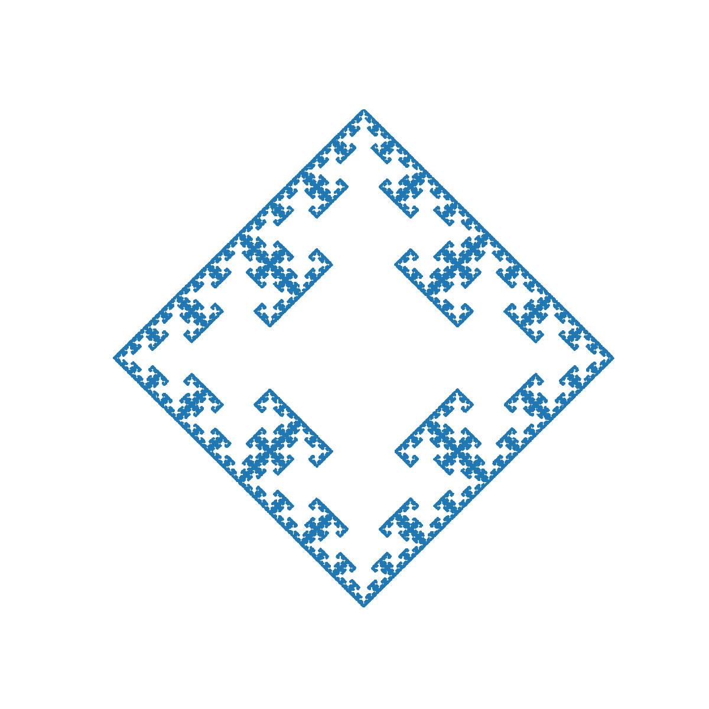

# Chaos Games

A Python package to run [chaos games](https://en.wikipedia.org/wiki/Chaos_game).
Run `python examples.py` to produce plots for the examples in `examples.py`.

I learned about chaos games while reviewing an AIME problem two years ago,
and I wrote a small script (around fifty lines) for chaos games then.
I lost the script later, so I implemented the `chaos` package to replace it.

The `chaos.math` module improves arithmetic precision with floats:
my original script could not construct complicated games correctly
because it used Python's default float precision.

# Examples

See `examples.py` and `examples` for more.

| The Sierpinski Triangle | A Square | A Pentagon | A Hexagon |
| --- | --- | --- | --- |
|  |  |  |  |
